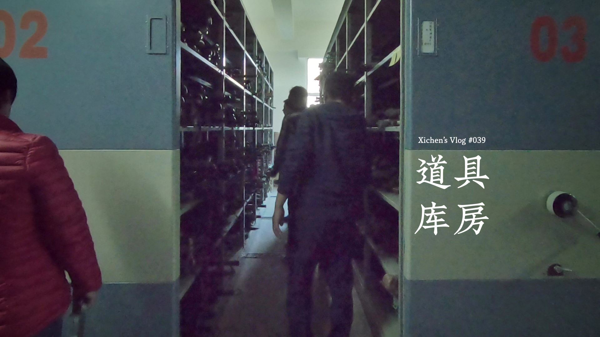
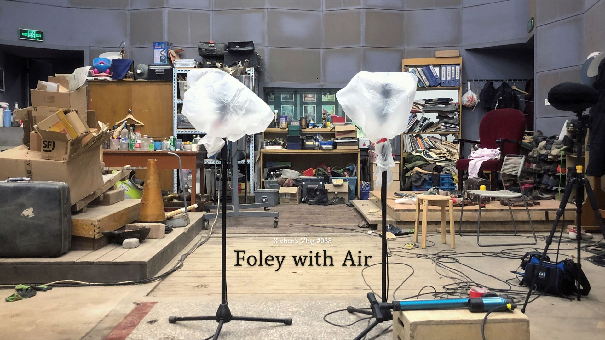
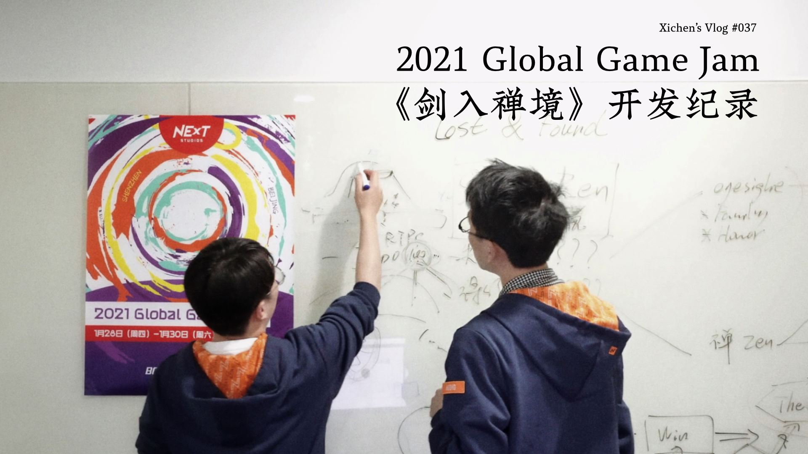
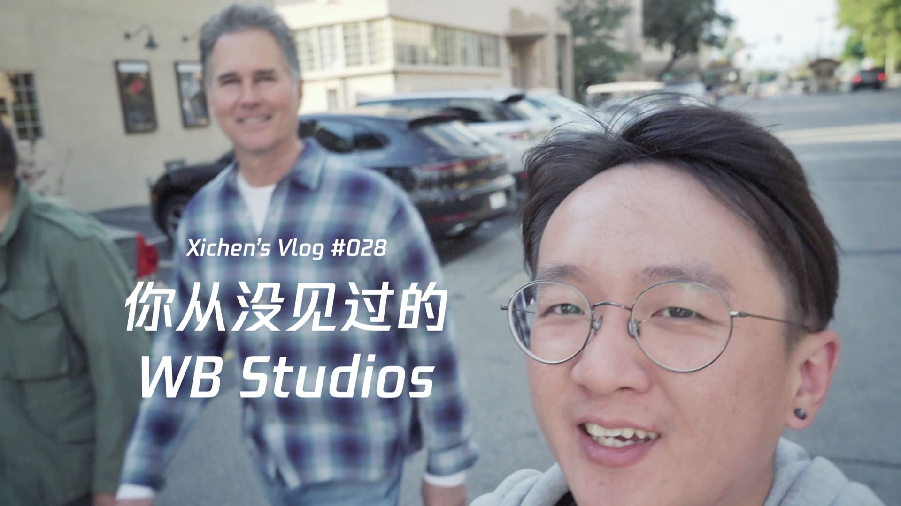
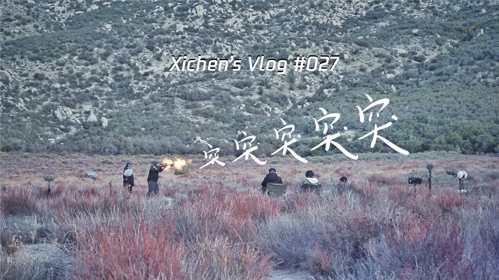
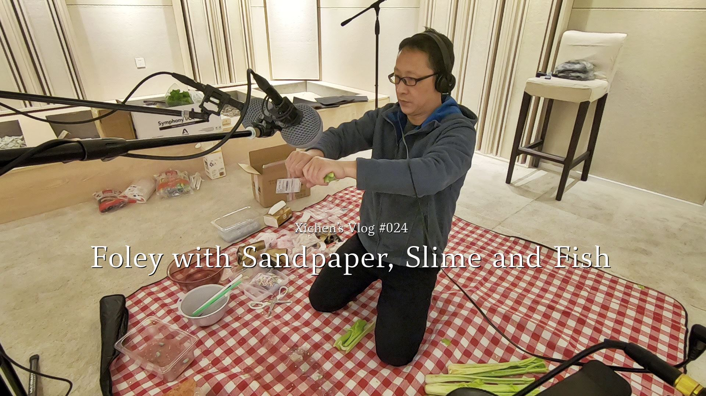

#### Xichen's Vlog #039 道具库房

[YouTube](https://www.youtube.com/watch?v=1pO5mkMhckw)
[Bilibili](https://www.bilibili.com/video/BV1Zq4y1T72y)

参观中影基地道具库房，走调的老钢琴独具魅力。

#### Xichen's Vlog #038 Foley with Air

[YouTube](https://www.youtube.com/watch?v=1tl_UAWcMfc)
[Bilibili](https://www.bilibili.com/video/BV1bf4y1A72d)

再赴北京怀柔中影基地录拟音。

#### Xichen's Vlog #037 2021 Global Game Jam《剑入禅境》开发纪录

[YouTube](https://www.youtube.com/watch?v=tlYmEOBl11g)
[Bilibili](https://www.bilibili.com/video/BV16v411s7i6)

又一次在 Game Jam 活动中与梓涛合作，完成了一部着重声音体验的小作品。

[《剑入禅境》游戏下载链接](https://yezi.itch.io/sz)

Music from Crouching Tiger, Hidden Dragon OST by Tan Dun, Yo-Yo Ma, Xie-yang Chen, David Cossin

#### Xichen's Vlog #036 我在外滩飞飞机

Xichen's Vlog #036 My Drone Flying above The Bund

[YouTube](https://www.youtube.com/watch?v=AzDUX9r7Ejc)
[Bilibili](https://www.bilibili.com/video/BV1oK4y1j72V)

2020年6月8日，友情参与拍摄项目，带着我的小飞机俯瞰难得一见的外滩夜景。

Music in Video:  
罗威 - 延安高架桥小夜曲

#### Xichen's Vlog #035 徐家渡米轨

Xichen's Vlog #035 Abandoned Metre-Gauge Railways in Xujiadu, Yunnan

[YouTube](https://www.youtube.com/watch?v=PaYudIfVo1I)
[Bilibili](https://www.bilibili.com/video/bv1iK4y1h7Sa)

南盘江边的徐家渡乡有一段米轨铁路。

1910年4月，滇越铁路全线建成通车，连接中国昆明和越南海防港，  
全长859公里，使用轨距为一米的窄轨铁路，又称“米轨铁路”，  
是中国西南地区的第一条铁路，也是中国第一条通车的国际铁路。  
据村民介绍，徐家渡站已于一年多前彻底停运，  
之后可能会被改造成观光小火车路线。

Music in Video:  
莫西子诗 - 山魈

#### Xichen's Vlog #034 青龙镇赶集

Xichen's Vlog #034 Rural Fair in Qinglong Town, Yunnan

[YouTube](https://www.youtube.com/watch?v=xkdf7FnKPpI)
[Bilibili](https://www.bilibili.com/video/BV145411j7KE)

在云南省玉溪市华宁县青龙镇的集市上，我见到了很多从没见过和许久未见的东西。

Music in Video:  
莫西子诗 - 赶集

#### Xichen's Vlog #033 湖光潋滟 山雾氤氲

Xichen's Vlog #033 Yunnan Fuxian Lake

[YouTube](https://www.youtube.com/watch?v=fUuDUrfdj1Y)
[Bilibili](https://www.bilibili.com/video/BV1HK4y1h7F5)

抚仙湖云海山居的169秒钟。

抚仙湖方寸间云海山居民宿  
云南澄江右所镇小湾村102号

Music in Video is from artlist.io:  
Cautious Fog by Harbor Fate

#### Xichen's Vlog #032 快乐合成器

[YouTube](https://www.youtube.com/watch?v=ov-9Wer4KCc)
[Bilibili](https://www.bilibili.com/video/BV16h411X7u7)

两位好友侯晨钟与叶梓涛的梦幻联动，关于合成器话题的有意思的对谈。

Music in Video is from artlist.io:  
Normalize by Stanley Gurvich

#### Xichen's Vlog #031 东滩月光

Xichen's Vlog #031 Moonlight on Dongtan, Shanghai

[YouTube](https://www.youtube.com/watch?v=6liCwO19ZFY)
[Bilibili](https://www.bilibili.com/video/BV1Qa4y1L7TC)

在一个柔软的夜晚，留下我属于都市的身体  
抬起手，是星云在燃烧  
背靠地球，我拨动以太的帷幕  
向黑暗的宇宙探出一束微亮  
而你，光年外的爱人，要如何才能轻抚我的脸庞  
——耿子骏

Music in Video:  
康姆士乐团 - 你要如何，我们就如何

#### Xichen's Vlog #030 侯老师开课啦

[YouTube](https://www.youtube.com/watch?v=ufFtdt9wKek)
[Bilibili](https://www.bilibili.com/video/bv1DT4y1j7qJ)

Audiokinetic 产品专家侯晨钟线下技术分享，巧遇学弟交流入行经验。

Music in Video is from artlist.io:  
Grumpy Snowflake by Peter Spacey

#### Xichen's Vlog #029 Audio Designer as Game Developer

[YouTube](https://www.youtube.com/watch?v=WIe9NFA_ZRA)
[Bilibili](https://www.bilibili.com/video/BV1Za4y1i7Rd)

把自己先定位成游戏开发者，这样你就知道做一名游戏音频设计师需要具备哪些基本技能了。侯老师分享个人学习方法，助你快速入行游戏音频设计。

Music in Video is from artlist.io:  
Better Now Instrumental Version by These Nuts

#### Xichen's Vlog #028 你从没见过的 WB Studios

Xichen's Vlog #028 A Special Warner Bros. Studio Tour

[YouTube](https://www.youtube.com/watch?v=PRqeI3vFDo0)
[Bilibili](https://www.bilibili.com/video/BV1P54y1R73e)

希辰带你参观华纳影城里深藏地下的录音室和拟音棚。

Mr. Longbottom Flies from Harry Potter and the Philosopher's Stone OST by John Williams  

Music in Video is from artlist.io:  
Endless Fields Pizzica to Version by Ian Post  
Beams by AM Beef  
Busy World by Lance Conrad  
Diamond by The Delorean

#### Xichen's Vlog #027 突突突突突

[YouTube](https://www.youtube.com/watch?v=P0d5BbLGoxA)
[Bilibili](https://www.bilibili.com/video/av93662654)

NExT Studios Audio Team 远赴美国洛杉矶完成了一次 Gun Recording Session。

THANKS  
[Bryan Watkins](https://www.imdb.com/name/nm0914265)  
Game Sound Supervisor at Warner Bros.  
[John Fasal](https://www.imdb.com/name/nm0268635)  
Legendary Recordist  
[ISS](https://issprops.com)  
Independent Studio Services  
Larry, Tim & Steve

Music in Video is from artlist.io:  
Overdrive by Anton Vlasov  
Punch by Oliver Michael  
Bionic Games by Ian Post  
Do the Math by SLPSTRM

#### Xichen's Vlog #026 NExT Game Jam

[YouTube](https://www.youtube.com/watch?v=yDq4LN-Dubw)
[Bilibili](https://www.bilibili.com/video/av80837219)

NExT Studios 48小时 Game Jam 全纪录，以及与知乎大V叶梓涛的深入长谈。

[《C(8,3)》游戏下载链接](https://yezi.itch.io/c38)

Music in Video are from BimBamBoom:  
Rainbow High  
Bright Up  
Soul Makossa  
Tokyo Aventure

#### Xichen's Vlog #025 Jerry.树: 取悦自己

[YouTube](https://www.youtube.com/watch?v=aYcr9OGJfDM)
[Bilibili](https://www.bilibili.com/video/av80414866)

Jerry 说带我感受摇滚乐的魅力，Jerry 还说要取悦自己。2019年11月22日，法兹乐队全国巡演，上海育音堂。

Music in Video are from 法兹乐队:  
临兵斗者  
控制

#### Xichen's Vlog #024 Foley with Sandpaper, Slime and Fish

[YouTube](https://www.youtube.com/watch?v=X9AdLHDRKGw)
[Bilibili](https://www.bilibili.com/video/av77526311)

为了设计某种怪物皮肤材质的声音，我们去 SoundMachine Studio 进行了一次拟音试验，探索了更多的可能性。

Music in Video:  
BimBamBoom - King & Joker

#### Xichen's Vlog #023 中影基地录 Foley

Xichen's Vlog #023 Foley at State Production Base of China Film Group

[YouTube](https://www.youtube.com/watch?v=MhqYJk3bvec)
[Bilibili](https://www.bilibili.com/video/av76029861)

NExT 快递员千里送话筒，幕后探秘中影基地拟音棚。

Music in Video is from John Wick (Original Motion Picture Soundtrack):  
Tyler Bates & Joel J. Richard - On The Hunt  
The Candy Shop Boys - Evil Man Blues

Font 喜鹊聚珍体 in Video is from [喜鹊造字](https://www.luckytype.com)

Website: [SounDoer.com](https://soundoer.com)  
Weibo: [希辰Xichen](https://weibo.com/soundoer)  
Bilibili: [希辰Xichen](https://space.bilibili.com/157914767)  
YouTube: [Xichen Shen](https://www.youtube.com/channel/UCyItXwxXhDPpbD60-4EYhvw)

---